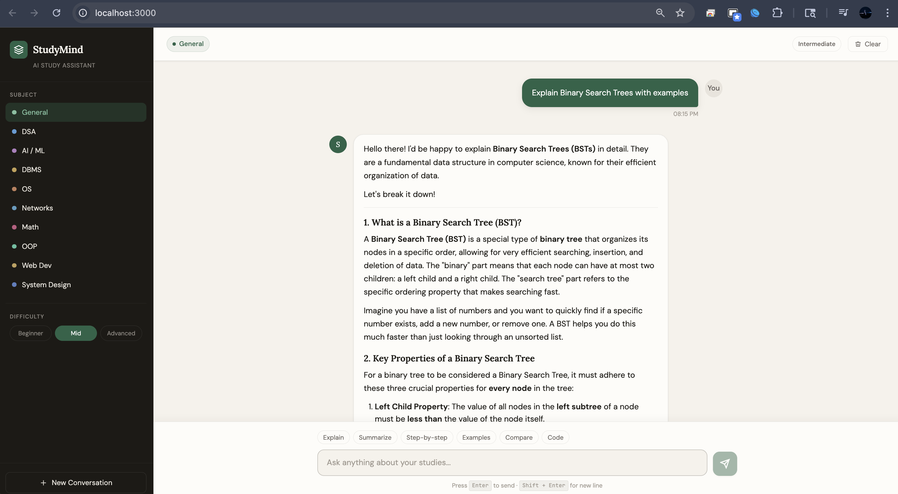

# 📚 StudyMind — AI-Powered Study Assistant

> Learn smarter, not harder. Your personal AI tutor that explains concepts clearly, solves problems step-by-step, and adapts to your level.


---

## 🎯 Project Overview

StudyMind is a purpose-built AI study assistant — not a generic chatbot. It's designed specifically for students who need clear, structured, educational responses. Whether you're trying to understand Binary Search Trees, need a step-by-step walkthrough of merge sort's time complexity, or want a quick summary of DBMS normalization before an exam, StudyMind delivers.

**What makes it different from a generic chatbot:**
- Subject-aware context (DSA, AI/ML, DBMS, OS, Networks, Math, OOP...)
- Difficulty-adaptive explanations (Beginner → Advanced)
- Structured markdown responses with headings, code blocks, and tables
- Purpose-designed UI that feels like a study tool, not a chat app
- Persistent chat history across sessions via localStorage

---

## ✨ Features

### Core Capabilities
- **Concept Explanation** — Clear, structured explanations with real-world analogies
- **Step-by-Step Solutions** — Methodical problem-solving with reasoning at each step
- **Summaries** — Bullet-point key ideas; great for exam prep
- **Code Help** — Well-commented code with time/space complexity analysis
- **Comparisons** — Structured tables (TCP vs UDP, Array vs LinkedList, etc.)
- **Quiz Prep** — Generate interview/exam questions with model answers

### Smart Context
- **Subject Selection** — 10 subjects: General, DSA, AI/ML, DBMS, OS, Networks, Math, OOP, Web Dev, System Design
- **Difficulty Toggle** — Beginner / Intermediate / Advanced — changes how deeply and technically the AI explains
- **Persistent History** — Conversations saved to localStorage and restored on reload
- **Context Window** — Sends last 30 messages for multi-turn learning conversations

### UI/UX
- Welcome screen with 6 suggestion cards to get started immediately
- Typing shortcuts bar (Explain / Summarize / Step-by-step / Examples / Compare / Code)
- Animated "Thinking..." indicator while AI processes
- Full markdown rendering: headers, bold, code blocks, tables, lists, blockquotes
- Auto-scrolling chat with smooth animations
- Error handling with user-friendly messages
- Mobile-responsive layout

---

## 🛠 Tech Stack

| Layer | Technology |
|---|---|
| Framework | Next.js 14 (App Router) |
| Language | TypeScript |
| Styling | CSS Custom Properties + Tailwind CSS |
| AI Model | Gemini 2.0 Flash (via REST API) |
| Fonts | Lora (display) + DM Sans (body) + JetBrains Mono (code) |
| Storage | localStorage (client-side history) |
| Deployment | Vercel |

---

## 🚀 Setup & Installation

### Prerequisites
- Node.js 18+ 
- A [Gemini API key](https://aistudio.google.com/app/apikey)

### 1. Clone and install

```bash
git clone https://github.com/yourusername/studymind-ai.git
cd studymind-ai
npm install
```

### 2. Configure environment variables

```bash
cp .env.example .env.local
```

Open `.env.local` and add your Gemini API key:

```env
GEMINI_API_KEY=AIza-your-key-here
GEMINI_MODEL=
```

### 3. Run in development

```bash
npm run dev
```


Open [http://localhost:3000](http://localhost:3000) — you should see the StudyMind welcome screen.




### 4. Build for production

```bash
npm run build
npm start
```

---

## 🌐 Deploy to Vercel

The fastest way to deploy:

```bash
npm install -g vercel
vercel
```

Or use the Vercel dashboard:
1. Push your code to GitHub
2. Go to [vercel.com](https://vercel.com) → New Project → Import your repo
3. Add `GEMINI_API_KEY` in Environment Variables
4. Click Deploy

That's it — Vercel auto-detects Next.js and configures everything.

---

## 📁 Project Structure

```
studymind-ai/
├── app/
│   ├── api/
│   │   └── chat/
│   │       └── route.ts          # API endpoint — calls Gemini
│   ├── globals.css               # All styles (CSS custom properties)
│   ├── layout.tsx                # Root layout with font config
│   └── page.tsx                  # Entry point
│
├── components/
│   ├── StudyAssistant.tsx        # Main container — state management
│   ├── Sidebar.tsx               # Subject + difficulty selector
│   ├── ChatHeader.tsx            # Active subject/difficulty display
│   ├── ChatMessages.tsx          # Message list + welcome screen
│   ├── MessageBubble.tsx         # Individual message with markdown
│   └── ChatInput.tsx             # Textarea + shortcut pills + send
│
├── types/
│   └── index.ts                  # TypeScript types + constants
│
├── .env.example                  # Template for environment variables
├── .gitignore
├── next.config.js
├── package.json
├── tailwind.config.js
└── tsconfig.json
```

---

## 🧠 Prompt Engineering

The system prompt is the heart of what makes StudyMind feel like a real tutor rather than a generic chatbot. It's injected dynamically with the current subject and difficulty level:

```
You are StudyMind, an expert AI study assistant and patient teacher.

Current Context:
- Subject Focus: [selected subject]
- Student Level: [Beginner/Intermediate/Advanced]

Response Format Rules:
- Use ## headings to organize long answers
- Use **bold** for key terms
- End complex explanations with a "💡 Key Takeaway"
- Use tables when comparing items
...
```

Key design decisions:
- **Structured output rules** force the AI to always use headings, lists, and code blocks — never walls of plain text
- **Subject injection** primes the model to use subject-appropriate terminology and examples
- **Difficulty injection** changes depth: Beginner gets analogies, Advanced gets edge cases and trade-offs
- **Anti-vagueness instruction** prevents hedge phrases like "it depends" without follow-up

---

## 🧪 Example Prompts to Test

| Category | Prompt |
|---|---|
| Concept | `Explain how a Hash Map works internally` |
| Step-by-step | `Solve step by step: What is the time complexity of quicksort?` |
| Summarize | `Summarize the key concepts of Database Normalization` |
| Code | `Write a Python implementation of BFS and DFS` |
| Compare | `Compare TCP vs UDP with a table` |
| Quiz | `Give me 5 interview questions on Operating Systems with answers` |
| Math | `Explain Big O notation with examples from O(1) to O(n!)` |
| Analogy | `Explain recursion using a real-world analogy` |
| Debug | `Why does my binary search return -1 when the element exists?` |
| Deep dive | `Explain the CAP theorem in distributed systems` |

---

## 🎨 Design Decisions

**Color Palette** — Warm parchment background (`#F5F2EB`) with a deep forest green accent (`#2A6348`). This avoids the clichéd purple-on-white AI aesthetic and creates a calm, focused study environment.

**Typography** — Lora (serif) for display text creates a scholarly, academic feel. DM Sans for body text ensures readability. JetBrains Mono for code maintains professional developer aesthetics.

**Dark sidebar** — The dark sidebar (`#1C1A16`) creates a clear visual hierarchy, separating navigation from content — similar to VS Code or Linear.

**No distractions** — No notifications, no avatars, no unnecessary chrome. The UI stays out of the way of learning.

---

## 🔒 Security Notes

- The API key is stored server-side only (in `.env.local`) — never exposed to the client
- API calls go through `/api/chat` (a Next.js server-side route), not directly from the browser
- localStorage only stores message content and settings — no sensitive data

---

## 📄 License

MIT — free to use, modify, and deploy.

---

## 💡 Why This Project?

Most AI chatbots are general-purpose — they can answer anything, but they're not optimized for learning. StudyMind is built with a single goal: help students understand things better. The structured prompt, subject context, difficulty levels, and purpose-built UI all serve that one goal. It's what happens when you design around a specific user need instead of building a generic tool.
# StudyMind
